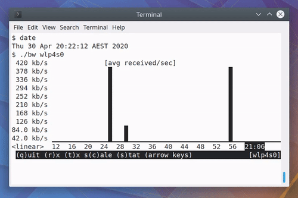

# bandwit

`bandwit` is a terminal based bandwidth monitor that runs on Linux and BSD.

The defining characteristic of `bandwit` is that it runs inline in your terminal,
without taking over the whole terminal screen like curses programs do.

## Keyboard controls

* `Enter` - Move the cursor one line down, enlarging the `bandwit` screen by
  one line.

* `r` - Switch to viewing bytes received.

* `t` - Switch to viewing bytes transmitted.

* `c` - Toggle between a linear, log10, and log2 scale.

* `s` - Toggle between aggregating by average or by sum.

* `Arrow Up / Arrow Down` - Increase/decrease the aggregation window where one column
  represents either:

  * One second.

  * One minute.

  * One hour.

  * One day.

* `Arrow Left / Arrow Right` - Scroll through historical data.

* `q` - Quit the program.

## Data sources

In Linux there are lots of places to get this information:

* `/sys/class/net/<iface>/statistics/{r,t}x_bytes` is the most convenient as
  it's a file with literally just the number we want in it.
* `/proc/net/dev` requires finding the right line and parsing the right
  integers.
* `ip -statistics link show dev <iface>` requires finding the right lines and
  parsing the right integers.

In BSD there is only one way I know that doesn't require linking against system
libraries:

* `netstat -ibn` requires finding the right line and parsing the right
  integers.

## Portability

* Written using C++17.
